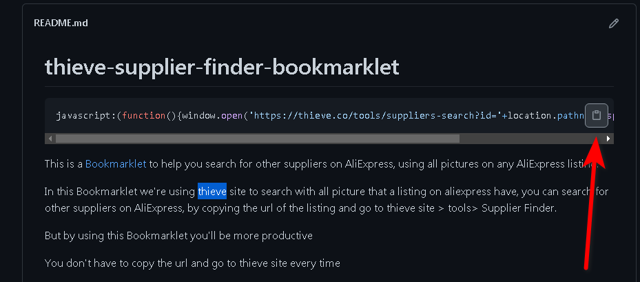
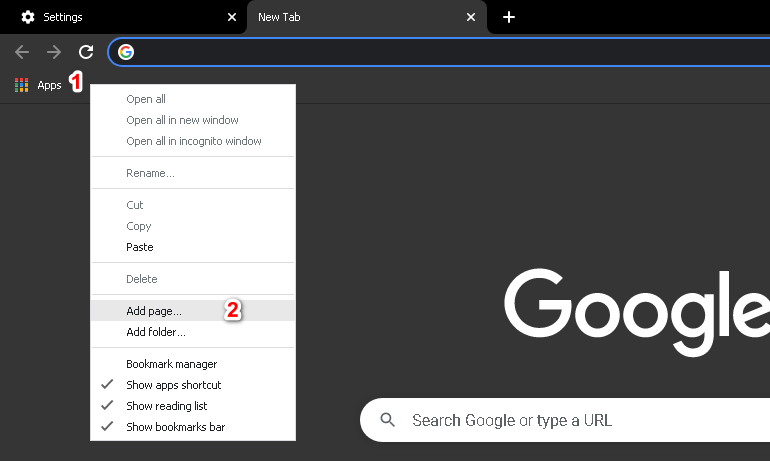
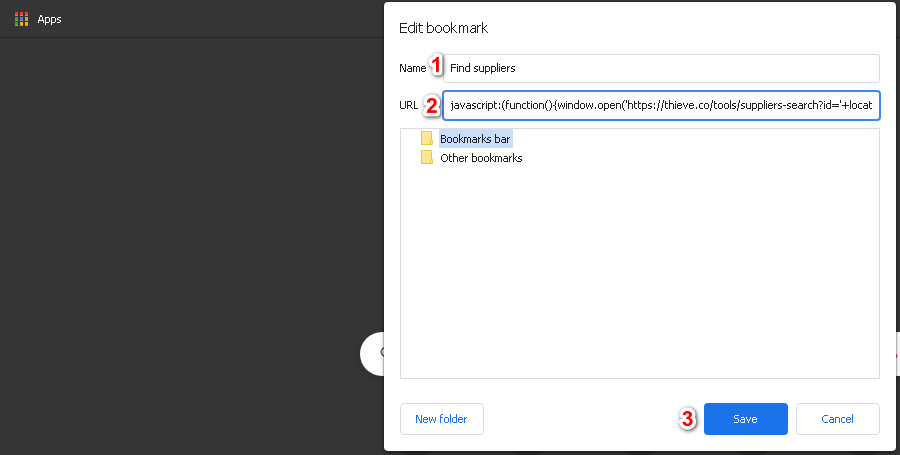
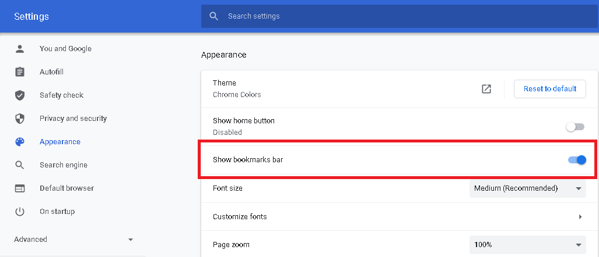

# thieve-supplier-finder-bookmarklet

### Copy this Javascript Code

```javascript
javascript:(function(){window.open('https://thieve.co/tools/suppliers-search?id='+location.pathname.split(".")[0].split("/").pop());})()
```
<br/>

This is a <a href="http://en.wikipedia.org/wiki/Bookmarklet">Bookmarklet</a> to help you search for other suppliers on AliExpress, using all pictures on any AliExpress listing.

In this Bookmarklet we're using <a href="https://thieve.co/?ref=0">thieve.co</a> site to search with all pictures that a listing on aliexpress have, you can search for other suppliers on AliExpress, by copying the url of the listing and go to thieve site > tools> Supplier Finder.

But by using this Bookmarklet you'll be more productive

You don't have to copy the url and go to thieve site every time

just one simple click will open a new browser tab and search on thieve site with all pictures.

<h2>How to use this Bookmarklet</h2>

<ol>
  <li>Create an account on <a href="https://thieve.co/?ref=0">thieve.co</a></li>
  <li>copy the code above 
  </li>
  
  
  
  <li>Right click on the bookmarks bar, and choose "Add Page"
    
   
    
  </li>
 
  <li>Enter a name, and in the URL put the code that you've copied from above, and click save.
    
  
    
  </li>
  <li>Go to any product on AliEpress and click on the Bookmarklet </li>
    
</ol>


## Note:
<ol>
  <li>
If you don't find the bookmarks bar, Go to Settings on chrome browser, and on the left side click on Appearance (chrome://settings/appearance), after that click on "Show bookmarks bar"
    </li>


  
  <li>You can also add the Bookmarklet to opera and Firefox Browser</li>
  
  </ol>
